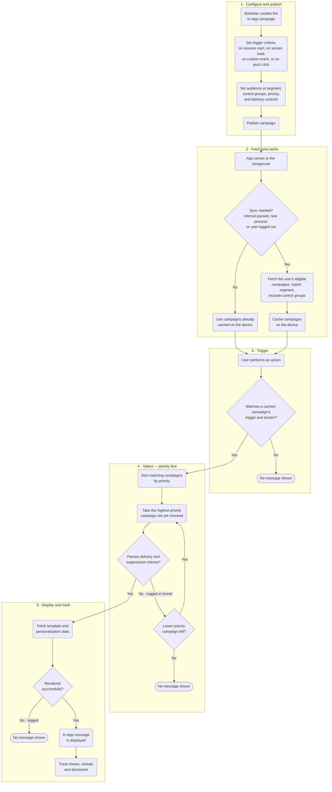

This article explains how In-App campaign delivery works in MoEngage, so you can predict when a message displays and diagnose why one did not. It covers the campaign settings that affect delivery, the conditions a user and their device must meet, and the SDK integration the channel depends on.

## Overview

An In-App message reaches a user through four stages, from setup in the dashboard to rendering on the device.

<Steps>
  <Step title="Campaign configuration">
    The rules you set while creating the campaign: trigger criteria, segment, control groups, priority, and delivery controls.
  </Step>
  <Step title="Eligibility and fetch">
    When the app opens, MoEngage determines which campaigns the user qualifies for, and the SDK fetches and caches them for the session.
  </Step>
  <Step title="Trigger and selection">
    The user performs a trigger action; the SDK matches cached campaigns by trigger and screen, applies delivery controls, and selects one by priority.
  </Step>
  <Step title="Display and tracking">
    The SDK fetches the template and assets, displays the message on a correctly integrated device, and tracks shown, clicked, and dismissed events.
  </Step>
</Steps>

## Campaign Configuration

### Trigger Criteria

The trigger criteria determine when a user sees the In-App message. In-App campaigns support four trigger criteria: **On session start**, **On screen load**, **On custom event**, and **On push click**. For configuration steps, refer to [Trigger Criteria](/user-guide/campaigns-and-channels/in-app-message/create/create-in-app-campaign#trigger-criteria).

- **On session start**: Displays the message as soon as a user's app session begins. A session starts when the user first interacts with the app and ends when the user logs out, enters from a new traffic source, or is inactive beyond the inactivity period (30 minutes by default).
- **On screen load**: Displays the message on a specific screen or app context. You can target **Any screen** (the message appears on any screen where a display method is called) or **Specific screens** (up to five screens, and optionally an app context).
- **On custom event**: Displays the message when the user performs a custom event tracked by the SDK. You can combine events with **AND**/**OR** conditions and add attribute filters to refine who qualifies.
- **On push click**: Displays the message when the user clicks a linked push notification and opens the app. Use this trigger to continue a push message inside the app, such as opening a detailed offer or landing experience after the push tap. Audience, priority, and delivery controls behave differently for this trigger, as described in the sections below.

<Info>
  - **Supported actions**: Only actions generated and tracked by the MoEngage SDK on the same device can be used as triggers.
  - **Unsupported actions**: Events sent through Data API or any other Server-to-Server (S2S) source, and events MoEngage generates internally such as App/Site Opened, Device Uninstall, Device Reinstall, and User Reinstall, cannot trigger In-App messages.
  - **Multiple campaigns on the same trigger**: For pop-up and full-screen (regular) In-App messages, the SDK selects and displays only one campaign per trigger, based on priority. Nudges are non-intrusive, and multiple nudges can appear together when they are configured for different screen positions or app contexts.
</Info>

#### Integration Requirements for Trigger Actions

Whether your app needs to call a display method on a screen depends on the trigger. Only **On screen load** requires `showInApp()` or `showNudge()` on the target screens; the other three triggers are detected by the SDK without an explicit display call.

| Trigger criteria | What your app must do |
| --- | --- |
| **On session start** | No display-method call is required on any screen. The SDK displays the message at session start. |
| **On screen load** (pop-up) | Call `showInApp()` on the target screens. |
| **On screen load** (nudge) | Call `showNudge()` on the target screens. |
| **On custom event** | Track the custom event through the SDK. No display-method call is required on any screen. |
| **On push click** | Link the In-App campaign to a push campaign. No display-method call is required on any screen. |

### Segmentation

While creating an In-App campaign, you can target all users or apply filters to target a specific audience. For configuration steps, refer to [Select Target Audience](/user-guide/campaigns-and-channels/in-app-message/create/create-in-app-campaign#select-target-audience).

At the campaign's scheduled start time, MoEngage evaluates the filter conditions and runs a segmentation query to identify eligible users. MoEngage maintains this user list, so the campaign is ready to deliver when an eligible user next opens the app.

Campaigns that use the **On push click** trigger are an exception: the audience is fixed to **All Users**, because the effective audience is the set of users who receive and click the linked push campaign.

#### Real-Time and Precomputed Segments

The filters and attributes you select determine how the segment is evaluated. MoEngage displays a banner during campaign creation that indicates which applies.

- **Real-time segments**: Segments built on user attributes, user events, event attributes, and event duration from the last 30 days are evaluated in real time. Users start seeing the message as soon as the campaign is published, and the eligible-user list stays current. Use these for time-sensitive promotions and announcements. For more information, refer to [Real-Time Segment Evaluation](/user-guide/segment/advanced-concepts/real-time-segment-evaluation).
- **Precomputed segments**: Segments that rely on historical event data beyond 30 days are calculated ahead of time. Membership refreshes on a configurable interval, ranging from 30 minutes to a few hours, so newly qualifying users may not receive the campaign immediately. For more information, refer to [Segment Processing](/user-guide/segment/getting-started/types-of-segments#segment-processing).

<Note>
  By default, segment membership is evaluated when the user opens the app, so attribute changes during a session are not reflected until the next app launch. To check eligibility again at the moment of display, enable [Re-evaluate Campaign Eligibility](/user-guide/campaigns-and-channels/in-app-message/create/create-in-app-campaign#re-evaluate-campaign-eligibility).
</Note>

#### Re-evaluate Campaign Eligibility

When you enable **Re-evaluate campaign eligibility before displaying**, the SDK intercepts the trigger and performs a live check against the backend before showing the message. If the user's attributes have changed during the session (for example, from a Free to a Paid plan), the SDK drops the now-irrelevant campaign, logs a failure, and fetches content relevant to the user's updated state to show on the next trigger.

<Info>
  - **SDK version**: In-App Android SDK 9.7.0 or later, and In-App iOS SDK 7.04.0 or later.
  - **Supported segments**: Available only for User Attribute–based segments and Real-Time Segment Evaluation (RTSE) segments. The option is hidden for segment types where real-time changes do not apply, such as static segments.
  - **Limit**: Available for up to five campaigns.
</Info>

#### Campaign Audience Limit

You can cap how many users a campaign reaches based on engagement metrics such as sends, impressions, and conversions, using total, daily, or instance-level limits. This is useful for controlling reach and cost. For more information, refer to [Campaign Audience Limit](/user-guide/settings/channels/delivery-controls/campaign-audience-limit).

#### In-Session Attributes

In-session attributes group users based on their activity in the current session. MoEngage checks the segmentation criteria first, followed by the in-session attributes.

You can use the following in-session attributes:

- **Query Parameter**: Segments users by query parameters in the URL they arrive on, such as UTM parameters, so you can tailor the message to the source or campaign that brought them in.
- **User Type**: Segments users as new or returning, based on whether the SDK already has stored details for them.
- **Day of the Week**: Segments users by the day of the week they visit.
- **Time of the Day**: Segments users by the one-hour slot of the day they visit.
- **GeoLocation**: Segments users by country, state/region, and city, or excludes a specific country.

In-session attributes are assessed during the user's session, in real time. They do not introduce a start-time delay or depend on a refresh interval. Common uses include personalizing by the user's current location and showing different offers to new and returning users.

For the full list and configuration steps, refer to [In-session Attributes](/user-guide/campaigns-and-channels/in-app-message/create/create-in-app-campaign#in-session-attributes).

### Control Groups

Users in a control group do not see the campaign, which gives you a baseline for measuring campaign impact. Control groups apply to promotional campaigns only; they are not applied to transactional campaigns.

- **Global control group**: A predefined set of users excluded from all marketing campaigns, used to measure the overall impact of your messaging.
- **Campaign control group**: Users excluded from a specific campaign, used to measure that campaign's effectiveness.

### Campaign Priority

When several campaigns qualify for the same trigger action, MoEngage uses priority to decide which one displays.

- **Priority level**: Set each campaign's priority to **Critical**, **High**, **Medium**, **Normal**, or **Low**. The campaign with the highest priority displays.
- **Creation date**: If two campaigns share the same priority, the most recently created or published campaign displays.

Assign priority levels deliberately so that the messages that matter most take precedence, and review them as your messaging goals change.

<Note>
  Campaigns that use the **On push click** trigger are prioritized automatically, so the linked In-App message displays over other eligible campaigns when the user opens the app after the click. You do not set the priority for these campaigns manually.
</Note>

### Delivery Controls

Delivery controls manage how often and how long In-App messages display, so users are not shown messages repeatedly.

- **Limit the maximum number of times a user can see messages from this campaign**: Caps the total displays per user to reduce message fatigue.
- **Add a minimum delay between two messages of this campaign**: Sets the interval between two displays of the same campaign, so the message does not reappear when a user repeats the trigger action in quick succession. This setting is disabled for nudge templates.
- **Ignore frequency capping**: Lets this campaign bypass the account-level frequency-capping limit.
- **Count for frequency capping**: Includes this campaign's displays in the overall frequency-capping count, so you can track the total number of messages delivered to a user.
- **Ignore global minimum delay**: Lets this campaign bypass the global delay that otherwise prevents users from seeing multiple In-App messages close together.
- **Auto dismiss message after**: Closes the message automatically after a set duration, even if the user does not act on it.

<Info>
  - Frequency capping and the per-campaign display limit (**Limit the maximum number of times a user can see messages from this campaign**) are tracked per user, not per device.
  - The display count is stored against the user, so it persists when the user logs out and logs back in. Earlier, signing out reset these counts and the user was evaluated from the beginning on the next login; this is no longer the case. Plan your caps accordingly, because a returning user resumes from their existing count rather than starting over.
</Info>

#### Frequency Capping

Frequency capping limits the total number of messages a user sees across campaigns within a defined window, so users are not overwhelmed even when they qualify for many campaigns at once. It is configured at the account level under **Settings > Channels > Delivery controls > Frequency capping**, where the settings are split into **Outbound Channels** (Push, SMS, Email, and so on) and **Inbound Channels** (In-App and On-Site Messaging). For In-App, frequency capping governs how often users see In-App messages in your app across campaigns.

- **Reset window**: The cap resets daily at 00:00, by default in the app's time zone. You can also reset it based on the user's time zone.
- **Per-campaign overrides**: In Step 3 (Schedule and goals) of campaign creation, you can override the account-level cap for a specific In-App campaign using the two toggles below.
- **Ignore frequency capping**: Lets an important campaign (for example, a service-outage announcement) display even when the user has reached the frequency cap.
- **Count for frequency capping**: When a campaign ignores the cap, enable this to still have its displays count toward the cap for other campaigns, so you can track the total number of messages delivered to the user.

For the full configuration, refer to [Frequency Capping](/user-guide/settings/channels/delivery-controls/frequency-capping). Support for In-App frequency capping requires In-App Android SDK 9.8.0 or later and In-App iOS SDK 7.04.0 or later.

## User Eligibility and Device Configuration

To receive an In-App campaign, a user must:

- Belong to the campaign's target segment.
- Perform the action that matches the campaign's trigger criteria.
- Use an app build with the required SDK integration in place.

Even when these conditions are met, a message may not display for the following reasons:

**Incomplete SDK integration**

- For **On screen load** campaigns, `showInApp()` or `showNudge()` is missing or incorrectly implemented on the target screens.
- For **On custom event** campaigns, the custom event used as the trigger is not tracked through the SDK.
- The SDK is not integrated or initialized correctly for the In-App channel.

**Delivery control restrictions**

- The user has reached the maximum number of displays for the campaign.
- A campaign-level, global, or frequency-capping delay is still in effect.
- There is a higher-priority campaign available.

**Eligibility restrictions**

- The user is in a control group for the campaign.
- With Re-evaluate Campaign Eligibility enabled, the user no longer matches the segment at the moment of display.
- The user is on a different screen than the one specified in the trigger criteria (screen mismatch).

**Device conditions**

- Network connectivity is poor, which can delay or fail the template and image fetch.
- Device settings restrict the app's network access.

For the specific reason a campaign failed to display, refer to the error breakdown on the campaign's info page. For more information, refer to [Analyze In-App Campaigns](/user-guide/campaigns-and-channels/in-app-message/analyze/analyze-in-app-campaigns).

## Campaign Fetch Behavior

The SDK syncs the user's eligible campaigns from the MoEngage server at specific points, sending the device ID (which MoEngage maps to the user ID), and caches them on the device until the next sync. A fetch happens in the following situations:

- **First app open after install**: On a fresh install, nothing has been synced yet, so the SDK fetches on the first foreground.
- **App foreground after the sync interval**: Each time the app comes to the foreground, whether a fresh launch or a return from the background, the SDK fetches again only if at least the minimum sync interval has passed since the last successful sync. The default interval is 15 minutes, counted only between two app opens. If the app stays in the foreground for more than 15 minutes, it does not sync again during that session.
- **A fresh app process (after the app is killed)**: If the app is force-closed or terminated and then reopened, the SDK fetches on the next foreground regardless of when it last synced, because the sync state is tracked per app process.
- **On user logout**: When the current user is cleared and a new user is created, the SDK fetches campaigns for the new user.

## Campaign Delivery Process

<Steps>
  <Step title="App launch">
    The user opens the app, and the SDK initiates a campaign fetch call to MoEngage.
  </Step>
  <Step title="User identification">
    The SDK sends the device ID, which MoEngage maps to the corresponding user ID. For a new or anonymous user, MoEngage creates a new user ID or an anonymous user ID.
  </Step>
  <Step title="Eligible campaign fetch">
    MoEngage evaluates which campaigns the user qualifies for based on segmentation and control groups, and returns the list to the SDK.
  </Step>
  <Step title="Trigger action detection">
    The user performs an action that matches a campaign's trigger criteria, and the SDK detects it.
  </Step>
  <Step title="Template fetch">
    The SDK makes a real-time call to fetch the campaign template and personalization data, so the message reflects current content.
  </Step>
  <Step title="Message display">
    The SDK renders the In-App message using the fetched template.
  </Step>
  <Step title="Event tracking">
    The SDK records interactions such as message shown, clicked, and dismissed, and sends them to MoEngage against the user's profile for reporting.
  </Step>
</Steps>

### How MoEngage Selects the Message to Display

When multiple In-App messages qualify for the same trigger action or screen, the SDK narrows them down as follows:

1. **Filtering**: The SDK keeps only the campaigns that match the current trigger action and screen name.
2. **Priority ordering**: It sorts the matching campaigns by priority. If several share the same priority, the most recently published campaign ranks higher.
3. **Delivery control checks (in priority order)**: Starting from the highest-priority campaign, the SDK applies that campaign's delivery-control and suppression checks, such as maximum times shown, minimum delay, global delay, and frequency capping. It displays the first campaign that passes all its checks.

Priority is evaluated first and decides the order of consideration; the delivery-control checks are then applied **per campaign**, in that order. If the highest-priority campaign fails a check (for example, it has reached its Maximum Times Shown limit), only that campaign is skipped; the SDK falls through to the next-highest-priority campaign and checks it, and so on. Reaching a cap on one campaign does not remove the user from consideration for other campaigns.

#### Suppression Checks Applied During Selection

Priority only decides the order in which campaigns are considered. Before a selected campaign is displayed, it must also pass every applicable check below. The reason a campaign was not shown is recorded on the campaign's Info page, grouped into Selection, Delivery, and Display failures. For the full list, refer to [Analyze In-App Campaigns](/user-guide/campaigns-and-channels/in-app-message/analyze/analyze-in-app-campaigns).

- **Higher-priority campaign available**: A higher-priority campaign was selected instead.
- **Maximum Times Shown**: Displaying the message would breach the campaign's own maximum-times-shown limit.
- **Minimum Delay Condition**: The campaign's own minimum delay between two of its messages has not elapsed.
- **Global Delay Condition**: The global minimum delay between two In-App campaigns has not elapsed since the last In-App message was shown.
- **Frequency capping**: The user-level frequency cap for In-App has been reached.
- **Another campaign visible**: Another campaign was already displayed at the same time before the selected campaign could have rendered.
- **Screen mismatch / context mismatch**: The user was on a different screen or app context than the one specified for the campaign.
- **Control group**: The user falls into the campaign control group or the global control group.
- **Campaign state**: The campaign is expired, paused, under review, rejected, or archived.
- **Render failures**: Image or GIF assets fail to load, the required GIF library is missing, the message height exceeds the device, or a file download fails.

## SDK Integration

In-App delivery depends on your app being integrated correctly for the channel.

- **Integration steps**: Follow the steps for your platform, including [Android](/developer-guide/android-sdk/in-app-messages/in-app-nativ), [iOS](/developer-guide/ios-sdk/in-app-messages/in-app-nativ), [React Native](/developer-guide/react-native-sdk/in-app-messages/inapp-nativ), and [Flutter](/developer-guide/flutter-sdk/in-app-messages/inapp-nativ). For other platforms, refer to the [Developer Guide](/developer-guide/introduction).
- **Image and GIF dependency (Android)**: Starting with In-App version 7.0.0, the Android SDK requires the [Glide](https://bumptech.github.io/glide/) library to render images and GIFs. If Glide is missing at runtime, In-App messages that contain images or GIFs fail to render.
- **Deep links**: In-App messages can send users to a specific screen or URL. Implement deep link handling in your app to support actions that use deep links. For more information, refer to [Create Navigation, Deeplinks, and Rich Landing](/user-guide/campaigns-and-channels/in-app-message/create/create-navigation-deeplinks-and-rich-landing).

## Supported Features and SDK Versions

Some In-App features require a minimum MoEngage In-App SDK version. Users must be on an app build that includes that SDK version for the feature to work on their device. The versions below refer to the In-App module; hybrid platforms (React Native, Flutter, Cordova, Capacitor) may have their own minimums.

| Feature | Android SDK Version | iOS SDK Version |
| --- | --- | --- |
| On session start / On screen load triggers (native only) | 9.0.0 or later | 6.06.0 or later |
| After Delay trigger time | 6.9.0 or later | 4.11.1 or later |
| Multiple triggers within an event (AND/OR conditions) | 8.1.0 or later | 5.0.1.1 or later |
| Nudges (`showNudge()`) | 7.0.0 or later | Refer to the [iOS Developer Guide](/developer-guide/ios-sdk/in-app-messages/in-app-nativ) |
| Re-evaluate campaign eligibility | 9.7.0 or later | 7.04.0 or later |
| Frequency capping | 9.8.0 or later | 7.04.0 or later |

## Delivery Flow Diagram

The diagram below shows how an In-App message travels from setup in the dashboard to display on a user's device, in five phases: configure, fetch, trigger, select, and display. The points where the flow stops are the same points to check when a message does not display; the reason for each stop is recorded in the campaign's delivery funnel.

